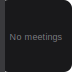
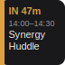
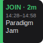
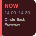
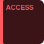

# Stream Deck Calendar

A macOS [Elgato Stream Deck](https://www.elgato.com/stream-deck) plugin that shows
your next meeting on a key and opens its join link with one press.

- **Shows your next meeting** — title, time range, and a countdown that scales
  itself (`IN 25m` → `IN 3h` → `IN 2d`).
- **One-press join** — from **2 minutes before** the meeting starts through its
  end, pressing the key opens the meeting link. Outside that window a press does
  nothing.
- **Finds the link anywhere** — uses the event's URL field, then its location,
  then its notes, recognising Google Meet, Zoom, Teams, FaceTime, Webex, Whereby,
  Jitsi, GoTo, BlueJeans, Chime, Skype, Discord, RingCentral and 8x8 (and falling
  back to the first link it finds).
- **Pick which calendars to watch** in the button's settings.

It reads your calendar through Apple's EventKit, the same source as the macOS
Calendar app, via a small bundled helper.

## What the key looks like

| State | Key | Looks like | Press |
|------|-----|-----------|-------|
| No upcoming meeting with a link |  | grey, "No meetings" | nothing |
| More than 2 min away |  | amber bar, `IN 25m` / `IN 3h` / `IN 2d` | nothing |
| Within 2 min of start |  | green bar, `JOIN · 1m` | opens the link |
| Meeting in progress |  | red key, `NOW` | opens the link |
| Calendar access not granted |  | red key, `ACCESS` | opens Calendar privacy settings |

## Requirements

- **macOS 12 or later**, on **Apple Silicon** (the helper builds an arm64 binary;
  see [Intel Macs](#intel-macs)).
- The **[Stream Deck app](https://www.elgato.com/downloads)** (6.5+) and a Stream
  Deck device.
- **Node.js 20+** and **npm**.
- A **Swift toolchain** to build the calendar helper — either:
  - **Full Xcode** (recommended), or
  - **Xcode Command Line Tools** *plus* **Homebrew Swift** (`brew install swift`).
    On some machines the Command Line Tools' own `swift build` is broken; the
    build script automatically prefers Homebrew's Swift when it's installed.

## Install

```bash
git clone <this-repo-url> stream-deck-calendar
cd stream-deck-calendar
npm install
npm run build
```

`npm run build` compiles the Swift helper into `CalendarHelper.app` and bundles
the plugin. If Swift stops with **"You have not agreed to the Xcode license
agreements"**, accept it once and re-run:

```bash
sudo xcodebuild -license accept
npm run build
```

### Grant Calendar access (important)

macOS only shows the Calendar permission prompt to a real app, not to a
background helper. So grant it **once, up front** by double-clicking the bundled
app and clicking **Allow / OK**:

```bash
open com.cianmm.calendar.sdPlugin/bin/CalendarHelper.app
```

(The app has no window — it just triggers the permission prompt and exits.) If
you skip this, the key will show a red **ACCESS** state until access is granted.

### Install into Stream Deck

```bash
npx streamdeck link com.cianmm.calendar.sdPlugin
npx streamdeck restart com.cianmm.calendar
```

Then in the Stream Deck app:

1. Find **Next Meeting** under the **Calendar** category (or search for it) and
   drag it onto a key.
2. With the key selected, open its **settings** (the panel at the bottom) and
   **tick the calendars** you want it to watch.

The key will now show your next meeting that has a join link, or "No meetings" if
there are none in the next 30 days.

## How it decides what to show

- It looks at the calendars you ticked, finds the soonest event that hasn't ended
  and has a join link, and shows that.
- A "join link" is taken from the event's **URL field** first, then its
  **location**, then its **notes** — preferring a known video-conferencing host,
  otherwise the first link found. Events with no detectable link are skipped.
- The join window is **`start − 2 min` through `end`**, inclusive. Press the key
  in that window to open the link.

## Development

| Command | What it does |
|---|---|
| `npm run dev` | Watch mode — rebuilds the plugin and reloads it in Stream Deck on every save (TypeScript changes). |
| `npm run reload` | One-shot: rebuild the TypeScript and restart the plugin. |
| `npm run reload:all` | Rebuild the **Swift helper** too, then restart. Use this after changing the helper. |
| `npm test` | Run the unit tests (state machine, rendering, helper client). |
| `npm run typecheck` | Type-check without emitting. |

Project layout:

```
com.cianmm.calendar.sdPlugin/   the installable plugin bundle
  manifest.json                 plugin + action definition
  bin/                          built plugin.js + CalendarHelper.app (git-ignored)
  ui/inspector.html             the calendar-picker settings UI
helper/                         Swift package for the EventKit helper
src/                            TypeScript plugin
  actions/next-meeting.ts       timers, rendering, key press, settings
  calendar/state.ts             pure state machine (what the key shows)
  calendar/render.ts            renders the key image (SVG)
  calendar/helper-client.ts     launches the helper, parses its JSON
scripts/build-helper.sh         builds the Swift helper into the .app bundle
```

> **Note:** the helper is ad-hoc signed, so each time you rebuild it
> (`npm run reload:all` or `npm run build`) its signature changes and macOS will
> ask you to grant Calendar access again. While iterating on the *plugin* code,
> use `npm run dev` / `npm run reload`, which don't rebuild the helper.

## Troubleshooting

- **Key shows red `ACCESS`.** Calendar access isn't granted to the helper.
  Double-click `com.cianmm.calendar.sdPlugin/bin/CalendarHelper.app` and allow it,
  or enable it under **System Settings → Privacy & Security → Calendars**.
- **"No meetings" but I have a meeting.** Check that the meeting's calendar is
  ticked in the button settings, that it starts within the next 30 days, and that
  it actually has a link (in the URL, location, or notes).
- **It re-prompts for Calendar access after a rebuild.** Expected — the helper is
  ad-hoc signed (see the note above).
- **Swift build fails with an Xcode license error.** Run
  `sudo xcodebuild -license accept`.
- **Swift build crashes referencing `SWBBuildService`.** That's the build engine
  from full Xcode failing on a Command-Line-Tools-only machine. Install Homebrew
  Swift (`brew install swift`) — the build script will use it automatically — or
  install full Xcode.

### Intel Macs

The build produces an arm64 binary. To run on an Intel Mac, build on a machine
with **full Xcode** (which can produce a universal binary), or adjust
`scripts/build-helper.sh` for your toolchain.

## Contributing

Contributions are welcome. A few things to know before you start:

### Getting set up

Follow [Install](#install) to get a working build, then use `npm run dev` for an
auto-reloading edit loop on the plugin code. See [Development](#development) for
the full script list and project layout.

### How the pieces fit together

The design keeps all decision-making in small, pure, testable TypeScript modules,
with a deliberately thin native surface:

- `src/calendar/helper-client.ts` launches the Swift helper and parses its JSON.
- `src/calendar/state.ts` is a pure function from "what the helper returned" +
  "the current time" to "what the key should show" — no I/O.
- `src/calendar/render.ts` turns that into the key image.
- `helper/Sources/calendar-helper/main.swift` is the only part that touches
  EventKit. Keep it minimal; push logic into the TypeScript where it can be
  tested.

### Expectations for changes

- **Write tests.** `state.ts`, `render.ts`, and `helper-client.ts` are covered by
  unit tests in `tests/`; add or update them alongside your change. Tests are
  written test-first where practical.
- **Keep it green.** `npm test` and `npm run typecheck` must both pass.
- **Match the surrounding style** — small focused modules, clear names, comments
  that explain *why* rather than *what*.
- **Pure logic stays timezone-safe and clock-injectable** — `computeRenderModel`
  takes `now` as an argument so it can be tested deterministically; don't reach
  for the wall clock inside it.

### Common changes

- **Support another meeting platform:** add its host to the `meetingHosts` list in
  `helper/Sources/calendar-helper/main.swift`, then `npm run reload:all`.
- **Change what the key shows:** edit `state.ts` (the render model) and/or
  `render.ts` (the drawing), and update the tests.

### Submitting

Work on a branch, make sure tests and type-checking pass, and open a pull request
describing the change and how you verified it (note that the calendar-reading and
Stream Deck parts need manual testing on real hardware — say what you checked).
